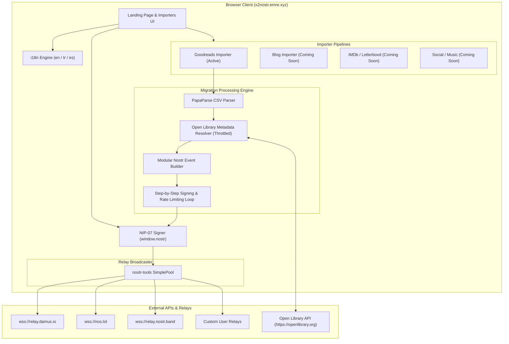

# Architecture & Technical Design — x2nostr

`x2nostr` (`x2nostr.emre.xyz`) is a sovereign, zero-knowledge, client-side data migration platform that empowers users to export their data from legacy walled gardens (Goodreads, IMDb, Blogs, Twitter/X, Instagram, Spotify, Letterboxd) and broadcast it directly to the Nostr protocol.

---

## 1. High-Level System Architecture

---

## 2. Component Breakdown

### 2.1. Framework & Routing: Hono on Cloudflare Pages
- **Server Entry (`src/index.ts`)**: Fast, lightweight Hono app serving static assets and dynamic meta tags, optimized for Cloudflare Pages edge deployment.
- **Client Entry (`src/client/main.ts`)**: Reactive client application managing view state, importer lifecycle, and real-time event updates.

### 2.2. Authentication & Key Management: NIP-07
- Authenticates using `window.nostr.getPublicKey()`.
- Converts raw hex public keys to human-readable Bech32 `npub1...` formats using `nostr-tools/nip19`.
- Queries user's configured relay list via `window.nostr.getRelays()`, falling back to high-reliability bootstrap relays.
- Signs constructed events per-item using `window.nostr.signEvent()`.

### 2.3. Internationalization (i18n) Engine
- Type-safe dictionary store (`src/locales/en.ts`, `src/locales/tr.ts`, `src/locales/es.ts`).
- English (`en`) serves as canonical fallback.
- Reactive language selector supporting English, Turkish (`tr`), and Spanish (`es`) with `localStorage` persistence.

### 2.4. Goodreads to Bookstr Migration Pipeline
1. **CSV Ingestion**: `PapaParse` cleans Goodreads-specific export quirks (e.g. `=""9780140449136""` formula wrappers).
2. **Metadata Resolution**: Queries Open Library (`https://openlibrary.org/search.json?isbn={ISBN}`) with fallback to Title + Author search. Includes an in-memory LRU cache and a 350ms delay queue to prevent HTTP 429 rate limits.
3. **Nostr Event Construction**:
   - **NIP-51 Lists**: Event Kind `30001` with `d` tags (`read`, `currently-reading`, `to-read`) and Open Library reference tags.
   - **Reading Logs & Reviews**: Event Kind `1985` or Kind `30078` containing rating (1-5 stars), review body, date read, and Open Library ID.
4. **Relay Broadcasting**: Events are signed and broadcast via `SimplePool` across default and user-defined relays simultaneously.

---

## 3. Security, Privacy & Zero-Knowledge Architecture

1. **Client-Side Only**: All parsing, signing, and API calls occur in the browser sandbox.
2. **No Data Retention**: No server database, cookies, or tracking analytics store user files or reading histories.
3. **Cryptographic Integrity**: Nostr cryptographic key signatures cannot be forged by intermediary proxies.
